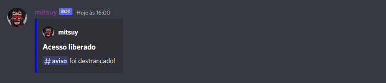

# Mitsuy-Discord.py

    
    

<h1>Olá, me chamo CarlosDev e hoje eu lhe apresento <b>Mitsuy</b></h1>
Mitsuy é um bot feito em python para o discord. Mitsuy foi criada para te ajudar a administrar o servidor, com tarefas chatas do tipo: <b>Criar canais, Deletar canais, Apagar as mensagens</b> entre outras coisas.

# Mitsuy possui as seguintes funções

	° lock = serve para trancar o chat

	° unlock = serve para destrancar o chat

	° seelock = serve para impedir que membros comuns vejam o chat

	° seeunlock = serve para permitir que membros comuns vejam o chat

	° clear = serve para limpar o chat

	° avatar = serve para ver o avatar da pessoa

	° ping = serve para ver a sua latência

	° criarcanal = serve para criar um novo canal

	° delcanal = serve para excluir o canal

	° say = serve para você fazer o bot falar algo

# Como configurar o bot
	° dentro do arquivo .env coloque seu token

	° o prefix padrão do bot vem como !, caso queira mudar entre no main.py e troque linha 4

